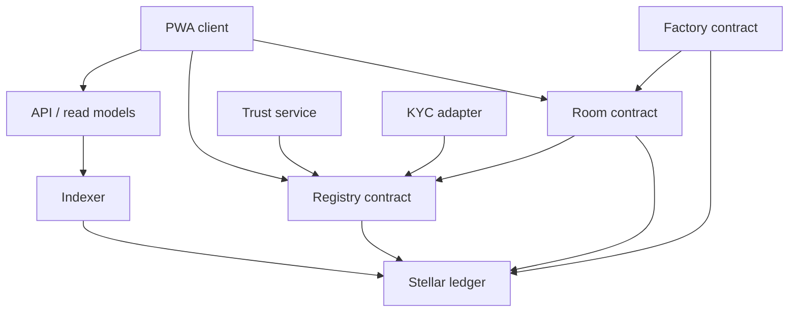
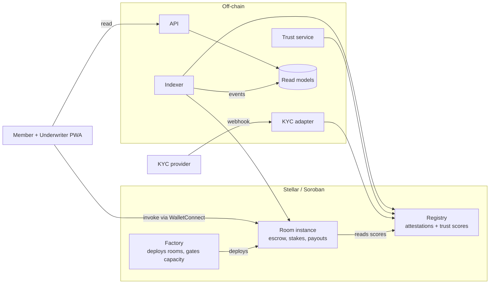
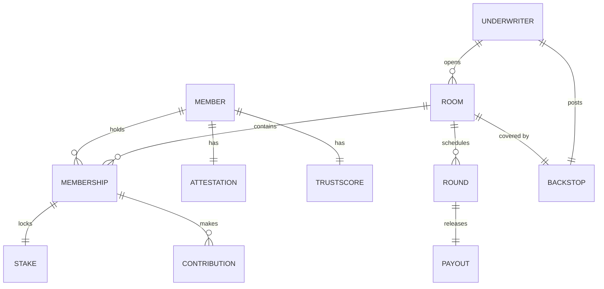

# Architecture Spine — Pal3 V1

## Design Paradigm

**Ledger-authoritative hexagonal.** Soroban contracts hold all authoritative state and all value. Every off-chain component is an adapter on one of two ports: a *read* port that projects chain events into query-friendly models, or a *write* port that submits transactions. No off-chain component is ever consulted to decide an outcome that moves money.

| Layer | Namespace | Role |
| --- | --- | --- |
| Domain (authoritative) | `contracts/` | Registry, Factory, Room — Rust/Soroban |
| Read adapters | `services/indexer/` | Chain events → read models |
| Write adapters | `services/trust/`, `services/kyc/` | Compute and submit; never authoritative |
| Query port | `services/api/` | Serves read models to clients |
| Client | `app/` | Mobile-first PWA |

## Invariants & Rules

### AD-1 — The ledger is the only system of record

- **Binds:** all
- **Prevents:** an off-chain database drifting from chain state and being trusted over it; two components disagreeing about who has paid.
- **Rule:** Any value that determines money movement or Member obligation is read from chain state at decision time. Off-chain stores are caches, rebuildable by replaying chain events, and are never the input to a contract decision.

### AD-2 — Contract topology is Registry + Factory + per-Room instance

- **Binds:** FR-1…FR-20
- **Prevents:** network-wide identity and reputation being trapped inside one Room's lifecycle; a defect in one Room reaching another Room's escrow.
- **Rule:** Exactly three contract kinds. **Registry** (one instance, network-wide) owns KYC Attestations and Trust Scores. **Factory** (one instance) deploys Rooms and enforces capacity and Backstop gates at creation. **Room** (one deployed instance per Room) owns that Room's escrow, Stakes, schedule, and Payouts. A Room reads Registry; Registry never reads a Room. No Room may reference another Room.

### AD-3 — All value-bearing state is persistent, with TTL extended on every write

- **Binds:** FR-4…FR-20
- **Prevents:** escrow, Stake, or Room schedule being archived mid-Cycle and rendering a Room unusable; catastrophic use of `temporary` for data that cannot be reconstructed.
- **Rule:** Room state, Stakes, escrow balances, Registry attestations, and Trust Scores use **persistent** storage. `temporary` storage is forbidden for any data whose loss would affect a Member's funds or obligations. `instance` storage holds only configuration read on every invocation. Every state-mutating invocation extends the TTL of the entries it touches.

### AD-4 — Entry expiry is never control flow

- **Binds:** FR-6, FR-8, FR-12, FR-14, FR-15
- **Prevents:** a Round boundary or Grace Window that any third party can stall indefinitely — Soroban TTL can be extended by anyone, so expiry is not a deadline.
- **Rule:** All time-based transitions compare the current **ledger timestamp** against a deadline stored in Room state. Transitions are effected by an explicit invocation, never inferred from an entry's absence or expiry. No contract logic may branch on whether an entry has expired.

### AD-5 — Trust Score is committed at join; ordering is computed on-chain

- **Binds:** FR-5, FR-10, FR-11, FR-13
- **Prevents:** the trust service being able to reorder a formed Room — which would make the "no human interference" claim false.
- **Rule:** On join, the Room contract **snapshots** the Member's Trust Score from Registry into its own state; that snapshot is immutable for the Room's lifetime and is what ordering uses. The join transaction carries the score value the Member was shown and reverts if Registry no longer matches it — so a score written between display and submission can never silently change the terms someone agreed to. The Room computes Payout Positions itself at Room start from its snapshots, applying the Fairness Floor and the deterministic tiebreak. No off-chain component ever submits an ordering.

### AD-6 — No privileged path to Member value

- **Binds:** FR-8, FR-12, FR-15, FR-16
- **Prevents:** an operator, Underwriter, or upgrade mechanism moving escrowed funds — the invariant the entire organizer-fraud claim rests on.
- **Rule:** No address holds authority to transfer escrow, alter a Payout Position after Room start, or reverse a Slash. Registry admin authority is limited to issuing and revoking Attestations and writing Trust Scores; it can never touch a Room's funds. Any upgrade mechanism, if present, must be incapable of altering an in-flight Room.

### AD-7 — Off-chain services submit or project; they never adjudicate

- **Binds:** all off-chain components
- **Prevents:** a Payout depending on a service being available, or a service outage stalling a Round.
- **Rule:** The trust and KYC services write to Registry only between Rooms — never during an active Cycle. The indexer and API are read-only. A total off-chain outage must leave every in-flight Room fully operable by direct contract invocation.

### AD-8 — Client contract bindings are generated, never hand-written

- **Binds:** FR-21, FR-22, FR-23
- **Prevents:** the PWA and the contracts drifting apart in type shape — a defect class that is silent until it moves money.
- **Rule:** TypeScript contract clients are generated from the built contracts via `stellar contract bindings`. Hand-written encoding of contract types in client code is prohibited. Regenerating bindings is part of the contract build, not a manual step.

### AD-9 — The default waterfall resolves atomically within one invocation

- **Binds:** FR-12, FR-14, FR-15, FR-16
- **Prevents:** a partial state where a Slash succeeded but the Payout did not — leaving a Member short and the Room inconsistent.
- **Rule:** Slash, Backstop draw, and Payout for a given Round execute in a single contract invocation that either fully succeeds or fully reverts. No Round may be left with the recipient underpaid. A Round advances only after the recipient holds the full Pot.

### AD-10 — No personal data on-chain

- **Binds:** FR-1, FR-2, FR-3, FR-5, FR-9
- **Prevents:** irreversible publication of Philippine citizens' identity data, which the Data Privacy Act makes a liability no amount of product value offsets.
- **Rule:** Contracts store only wallet addresses, an opaque KYC Provider reference, an attestation tier, and integers. No name, document, employer, bank detail, or hash derived from a raw identity document is written on-chain.

### AD-11 — Every outcome is deterministic and independently reproducible

- **Binds:** FR-10, FR-11, FR-12, FR-13, FR-15
- **Prevents:** an unverifiable Payout order or Slash amount — and any dependency on verifiable randomness, which Soroban does not provide natively.
- **Rule:** No randomness anywhere. Payout ordering, Stake sizing, Slash amounts, and Trust Score changes are pure functions of committed state and ledger timestamp, reproducible by any observer from chain history alone.

### AD-12 — Contracts are public under a permissive licence

- **Binds:** `contracts/`
- **Prevents:** members being asked to escrow money in code they cannot inspect.
- **Rule:** All Soroban contract source is published under Apache 2.0 from first deployment. `[ASSUMPTION: Apache 2.0 over MIT, for the explicit patent grant]`

### AD-13 — Round advancement is permissionless

- **Binds:** FR-8, FR-12, FR-14, FR-15
- **Prevents:** a deadlocked Room. AD-4 requires an explicit invocation to advance a Round, and AD-7 forbids off-chain services from adjudicating — without this rule, nothing in the system is authorized to move a Round forward.
- **Rule:** `advance_round` is callable by **any** address once the ledger timestamp passes the Round deadline. It is idempotent, reverts if called early, and its effect is identical regardless of caller. An off-chain keeper may call it as a convenience, but the Room's liveness must never depend on the keeper existing — any Member, the Underwriter, or a stranger can unstick a Room.

### AD-14 — Backstop capital is held by the Room it collateralizes

- **Binds:** FR-15, FR-16, FR-17, FR-19
- **Prevents:** the waterfall needing a cross-contract call mid-Payout, which would put AD-9's atomicity at risk; and ambiguity over whether the Factory or the Room custodies Backstop funds.
- **Rule:** The Factory transfers the required Backstop into the Room contract at Room creation, before the Room admits Members. All Backstop draws are local to the Room. Undrawn Backstop returns to the Underwriter at Room close. The Factory never custodies Member or Backstop value beyond the creation transaction.

### AD-15 — The acting party is the transaction source; no separate auth-entry signing

- **Binds:** FR-8, FR-21, FR-22
- **Prevents:** the mobile surface becoming unbuildable. Soroban's `signAuthEntry` path is not exposed by Stellar Wallets Kit's WalletConnect module, so a design requiring separate auth entries would force a bespoke WalletConnect integration on the product's primary surface.
- **Rule:** Contract entry points are designed so the address being authorized is the transaction source account — a single `require_auth` on the invoker, satisfied by signing the transaction itself. No entry point may require a Member to sign a detached authorization entry. Multi-party authorization within one invocation is prohibited in V1.

### Dependency direction



Reading the arrows: nothing points *from* a contract *to* an off-chain service. That absence is the rule (AD-7).

## Consistency Conventions

| Concern | Convention |
| --- | --- |
| Naming | Contract types and functions use PRD Glossary terms verbatim — `Room`, `Member`, `Underwriter`, `Contribution`, `Pot`, `Stake`, `Backstop`, `TrustScore`, `PayoutPosition`. A synonym in code is a defect. |
| Money | All amounts are integer stroops of the Room's stablecoin asset. No floating point anywhere in contracts or services. Amounts are never formatted for display below the client layer. |
| Time | Ledger timestamp (seconds) is the sole time source in contracts. Cadence and Grace Window are stored as second offsets. Clients display local time; contracts never receive one. |
| Identifiers | `Member` is keyed by Stellar address. `Room` is keyed by its deployed contract address. Attestations carry an opaque provider reference string, never a derived identity hash. |
| Errors | Contracts use a single `#[contracterror]` enum per contract with stable discriminants; codes are never renumbered once deployed. Clients map codes to copy, never parse messages. |
| Events | Every state transition that moves value or changes a Trust Score emits an event. The indexer is built only from events — never from state polling — so read models stay replayable. |
| Trust Score | Computed off-chain as a pure function of chain event history (AD-1). The same event sequence must always yield the same score; the function is versioned and its version recorded with each commit. |
| Config | Contract addresses and network passphrase come from environment at build/deploy; never hard-coded in client or service source. |

## Stack

| Name | Version |
| --- | --- |
| soroban-sdk | 25.0.0 |
| Rust | 1.84+ (target `wasm32v1-none`) |
| stellar-cli | `[ASSUMPTION: pin the installed version at project setup — provides `contract build` and `contract bindings`]` |
| Stellar network | Testnet → Mainnet |
| @stellar/stellar-sdk | `[ASSUMPTION: pin at install — version not verified at authoring]` |
| Stellar Wallets Kit | `[ASSUMPTION: pin at install]` — viable **only under AD-15**; its WalletConnect module exposes `signXDR` and `signAndSubmitXDR` but not `signAuthEntry` |
| TypeScript / Node | `[ASSUMPTION: one language across services and client, to limit context-switching for a solo build]` |
| PostgreSQL | `[ASSUMPTION: read models only — rebuildable, not authoritative]` |

## Structural Seed

### Container view



### Core entities



### Source tree

```text
pal3/
  contracts/
    registry/        # attestations, trust scores — network-wide
    factory/         # room deployment, capacity + backstop gates
    room/            # escrow, stakes, schedule, waterfall, payout
    shared/          # common types, error enums, glossary-named structs
  services/
    trust/           # score computation from chain events; commits to Registry
    kyc/             # provider webhook -> attestation issuance
    indexer/         # chain events -> read models
    api/             # read-only query surface for the client
  app/               # mobile-first PWA, WalletConnect
  bindings/          # GENERATED TypeScript contract clients — never hand-edited
```

## Capability → Architecture Map

| PRD area | Lives in | Governed by |
| --- | --- | --- |
| FR-1…FR-3 Identity | `contracts/registry`, `services/kyc` | AD-2, AD-10 |
| FR-4…FR-7 Room lifecycle | `contracts/factory`, `contracts/room` | AD-2, AD-3, AD-4 |
| FR-8, FR-9 Contributions and escrow | `contracts/room` | AD-3, AD-6, AD-9 |
| FR-10…FR-13 Trust engine | `services/trust` → `contracts/registry`; ordering in `contracts/room` | AD-5, AD-7, AD-11 |
| FR-14…FR-17 Default waterfall | `contracts/room` | AD-4, AD-9, AD-11 |
| FR-18…FR-20 Capacity, adequacy, fees | `contracts/factory`, `contracts/room` | AD-2, AD-6, AD-14 |
| FR-21…FR-23 Member application | `app/`, `bindings/`, `services/api` | AD-1, AD-7, AD-8, AD-15 |
| Round liveness (cross-cutting) | `contracts/room`, optional keeper | AD-4, AD-13 |

## Deferred

- **Upgradeability.** Whether contracts are upgradeable at all is deferred to the audit-readiness pass (T2). AD-6 already forbids any upgrade path that could alter an in-flight Room, which is the constraint that matters; the mechanism can follow.
- **Stalled-Room TTL rescue.** AD-3 extends TTL on write, which covers Rooms with weekly activity. A Room frozen long enough to approach archival has no cheap rescue path. A permissionless `extend_room_ttl` entry point is the likely fix, and AD-13 establishes the permissionless-caller precedent for it. *Revisit before the mainnet pilot opens.*
- **Indexer and API hosting.** Deployment topology, environments, and provider choice are not decided. Deferred: V1 serves one Room and a cohort under twelve, so hosting is not yet a constraint on any other decision. *Revisit before the mainnet pilot.*
- **Fee accrual mechanics.** Whether the Underwriter fee accrues per Contribution in-contract or is settled at Cycle close. Both variants are local to the Room contract and to FR-20's build, so neither can cause two components to diverge. Deferred to the FR-20 build.
- **Multi-Room trust-graph effects.** Structurally absent in V1 (one Room). Deferred to the second cohort.
- **Key management for the trust service.** The Registry-writing key is an operational concern with no V1 answer beyond a single operator key. *Revisit before any third-party Underwriter onboards.*
