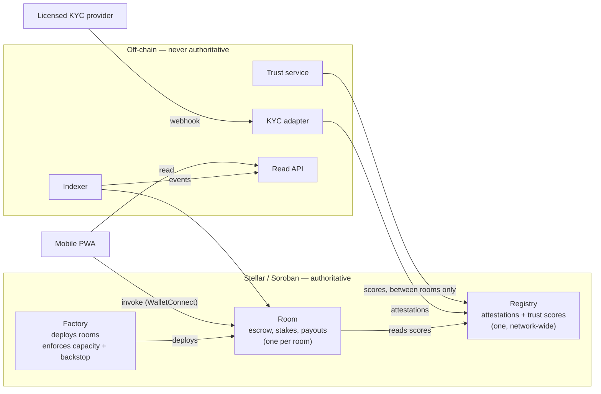
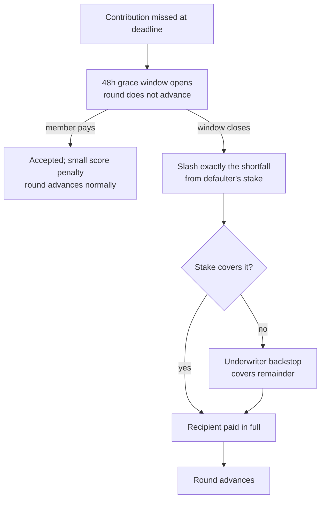

# Pal3 — Architecture Outline

*Prepared for Stellar Community Fund #45. Self-contained; no external references required.*

---

## 1. What the system does

Pal3 is an on-chain implementation of the Filipino **paluwagan** — a rotating savings circle where a group contributes a fixed amount on a fixed schedule and each member receives the entire pot once per cycle.

The traditional form fails in two ways. A human organizer holds the pooled money and can disappear with it — the pattern behind the "Online Paluwagan" schemes the Philippine SEC issues advisories against, and behind the Repa Paluwagan collapse that cost roughly ₱2B across Davao and Bohol. Separately, a member can take the pot and stop contributing, which cascades onto everyone scheduled after them.

Pal3 removes the first failure structurally: a Soroban contract custodies every contribution, and no address — including the operator's — has authority to move escrowed funds. It addresses the second with a trust engine: identity-anchored reputation that orders payouts, a collateral stake that absorbs a missed contribution, and an underwriter backstop that covers the remainder. **The scheduled recipient is paid in full in every branch.**

## 2. Why Stellar, specifically

The dependency is economic, not incidental.

A member contributes roughly **₱1,000 (~US$18) weekly**. On a chain with meaningful transaction fees, a $0.50 fee is close to **3% of every contribution, every week** — charged against a product whose proposition is that it is cheaper and safer than an alternative that is currently free. There is no version of this product that works on a high-fee chain. Stellar's fee structure is what makes weekly micro-contributions viable at all, and it appears in our specification as a hard non-functional requirement, not an optimization.

Three further properties are load-bearing:

- **Predictable, fast finality.** Rounds settle on fixed schedule boundaries. A contribution that may or may not have landed by the deadline is a correctness problem, not a UX one.
- **Soroban's authorization model.** `require_auth` on the invoking account gives us exactly the guarantee we need — that a member authorized their own contribution — without building a permission layer.
- **The anchor network** is the realistic route to our Phase 2 objective: settling in a regulated Philippine peso stablecoin rather than a USD-pegged asset.

We also removed a dependency rather than adding one. Payout ordering originally called for verifiable randomness to break ties. Soroban has no native VRF, and the available path is a cross-chain relayer. Rather than import that dependency, we redesigned ordering to be **fully deterministic** — trust-ranked with a published tiebreak — which is both simpler and more auditable. Nothing in Pal3 requires randomness.

## 3. System shape

Three contracts and four off-chain components. The governing principle: **the ledger is the only system of record.** Every off-chain component either projects chain state for reading or submits a transaction. None is ever consulted to decide an outcome that moves money.

**Registry** holds KYC attestations and trust scores. It is network-wide because reputation must outlive any single room — a member's record follows them everywhere, which is precisely what pseudonymous on-chain ROSCAs could not do.

**Factory** deploys rooms and enforces two gates at creation: the underwriter's capacity tier, and the requirement that backstop capital is posted *before* the room admits anyone.

**Room** is deployed per instance. Each room's escrow is physically isolated — a defect in one room cannot reach another's funds. For a product asking people to escrow savings, we considered that worth the extra deployment cost.

## 4. Money flow, and the guarantee

Each round, every member contributes; the contract holds the total; one member receives the whole pot. Payout order is set by trust score at room start and frozen.

When a contribution is missed:

Two properties make this a guarantee rather than an intention:

**Atomicity.** Slash, backstop draw, and payout execute in a single contract invocation that either fully succeeds or fully reverts. There is no state in which the slash landed and the payout did not.

**No privileged path.** No address can transfer escrow, alter a payout position after room start, or reverse a slash. Registry admin authority extends only to issuing attestations and writing scores, and can never touch room funds.

## 5. The trust engine, and where its boundary sits

Trust scores are computed **off-chain** — as a deterministic function of on-chain event history — and committed on-chain. We want to be precise about what that means for trust assumptions, because it is the part a reviewer should interrogate.

A member's score is snapshotted into the Room contract when they join, and is immutable for that room's lifetime. The join transaction carries the score the member was shown and **reverts if Registry no longer matches it**, so a score cannot change between display and commitment. The Room contract then computes payout ordering itself, on-chain, from its own snapshots.

The consequence: the operator can set a score *before* someone joins — and that member sees it before any funds move — but **once a room forms, no one can reorder it.** Ordering is not submitted by any off-chain component. Score computation is a versioned, published function; the same event history always yields the same score, and any observer can reproduce it from chain data alone.

Off-chain services write to Registry only *between* rooms, never during an active cycle. A total backend outage leaves every in-flight room fully operable by direct contract invocation.

## 6. Identity and personal data

Pal3 processes personal data of Philippine citizens and is subject to the Data Privacy Act of 2012.

Verification runs entirely through a licensed third-party KYC provider, which is the **sole custodian** of identity documents, employment records, and bank details. Pal3 receives an attestation — verification tier, issue date, opaque provider reference — and nothing more. **No personal data is written on-chain**, and no hash derived from a raw identity document. On-chain data is wallet addresses, integers, and room state.

This is architectural rather than procedural: the system cannot leak what it does not hold.

## 7. Technical decisions worth stating

**Storage durability.** All value-bearing state — escrow, stakes, room schedules, registry entries — uses persistent storage with TTL extended on every write. Temporary storage is prohibited for anything affecting member funds.

**Expiry is never control flow.** Soroban TTL can be extended by anyone, so an entry's expiry cannot be trusted as a deadline. Every time-based transition compares ledger timestamp against a deadline held in room state, effected by an explicit invocation.

**Round advancement is permissionless.** `advance_round` is callable by any address once the deadline passes, and is idempotent. A keeper may call it for convenience, but room liveness never depends on one existing — any member, the underwriter, or a stranger can unstick a room.

**Authorization is single-party by design.** Entry points are structured so the address being authorized is the transaction source, satisfied by signing the transaction itself. No detached authorization-entry signing is required. This keeps the mobile surface on the mainstream Stellar wallet path.

**Client bindings are generated,** not hand-written, via `stellar contract bindings` — eliminating type drift between contracts and client.

## 8. Stack

| Component | Technology |
| --- | --- |
| Contracts | Rust, soroban-sdk 25.0.0, target `wasm32v1-none` (Rust 1.84+) |
| Build | `stellar contract build` / `stellar contract bindings` |
| Client | Mobile-first PWA, TypeScript, WalletConnect |
| Off-chain services | TypeScript/Node — trust, KYC adapter, indexer, read API |
| Read models | PostgreSQL, rebuildable by replaying chain events |
| Network | Testnet → Mainnet |

## 9. Open source

All Soroban contract source is published under **Apache 2.0** from first deployment. For a product asking people to escrow money alongside strangers, publicly auditable contract source is part of the trust proposition rather than a concession to it.

## 10. Team

Solo founder. Four years of professional smart contract development (Solidity/EVM), migrating to Rust/Soroban for this build.

The transferable capability is contract engineering under adversarial conditions — escrow, custody of pooled funds, slashing logic, upgrade safety. Soroban is a language migration on top of an established discipline rather than a first attempt at smart contracts. The architecture above reflects that: the Soroban-specific decisions that differ most sharply from EVM — storage durability and TTL, expiry not being a deadline, the authorization model — are settled in the specification rather than left to be discovered during implementation.

Single-founder execution risk is real, and there is no in-house audit capability. Audit-readiness is therefore a funded milestone rather than an assumption.

## 11. Known open items

Stated rather than omitted:

- **Stalled-room TTL rescue.** TTL extends on write, which covers rooms with weekly activity. A room frozen long enough to approach archival needs a permissionless `extend_room_ttl` entry point. To resolve before the mainnet pilot.
- **Deployment and operations topology.** Not yet decided. V1 serves one room and a cohort under twelve, so hosting does not currently constrain any other decision.
- **Regulatory confirmation.** The underwriter's premium income raises a Philippine SEC investment-contract question and a possible Insurance Commission suretyship question. Counsel review is a funded milestone. Note that member-side exposure is structurally minimal: Pal3 promises members no return whatsoever, which is the specific feature that distinguishes it from the schemes the SEC prosecutes.
- **Peso rail.** V1 settles in a USD-pegged stablecoin; pilot members carry FX exposure for a cycle and consent to it explicitly. Migration to a regulated peso stablecoin is the Phase 2 objective.
